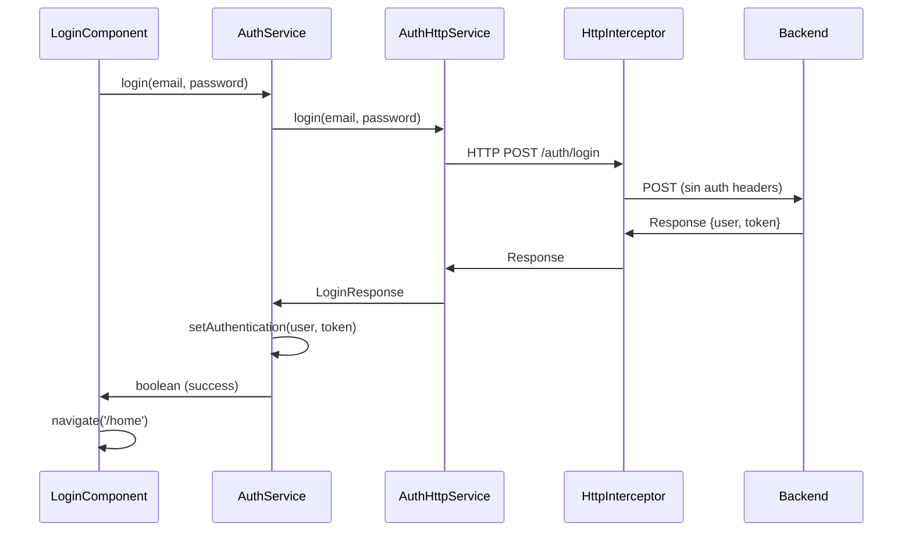

# 🔐 Debugging del Login - IntelliSpace

## ✅ Correcciones Aplicadas

### 1. **Logging Mejorado**
- ✅ Agregado logging detallado en `AuthService.login()`
- ✅ Agregado logging detallado en `AuthHttpService.login()`
- ✅ Logging de respuestas HTTP para debuggear

### 2. **Interceptor HTTP Simplificado**
- ✅ Simplificado el interceptor para debugging
- ✅ Solo agrega headers a endpoints que no son públicos
- ✅ No interfiere con las respuestas de login
- ✅ Logging detallado de requests y responses

### 3. **Manejo de Errores Mejorado**
- ✅ Validación de respuesta de login antes de procesar
- ✅ Manejo de errores más robusto en el componente
- ✅ Mensajes de error más descriptivos

## 🧪 Para Probar el Login

### Credenciales de Prueba
Usa las siguientes credenciales para probar:

```
Email: admin@test.com
Password: admin123
```

O las credenciales que tengas configuradas en tu backend.

### 🔍 Debugging en Consola

Cuando hagas login, deberías ver en la consola del navegador (F12 → Console):

1. **AuthService.login**: Iniciando login
2. **AuthHttpService.login**: Iniciando proceso de login  
3. **HTTP Request intercepted**: Detalles de la request
4. **HTTP Response received**: Detalles de la response
5. **AuthHttpService.login**: Respuesta HTTP de login
6. **AuthService.login**: Respuesta de login recibida

### 🚨 Si Hay Errores

Si el login falla, verifica:

1. **URL del Backend**: Asegúrate de que `http://localhost:3500` esté funcionando
2. **Endpoint**: Verifica que `/auth/login` esté disponible
3. **CORS**: Verifica que no hay problemas de CORS
4. **Credenciales**: Verifica que las credenciales sean correctas

### 📝 Ejemplo de Request Esperada

La request debería verse así:

```
POST http://localhost:3500/auth/login
Content-Type: application/json

{
  "email": "admin@test.com",
  "password": "admin123"
}
```

### 📝 Ejemplo de Response Esperada

La response debería verse así:

```json
{
  "user": {
    "id": "123",
    "email": "admin@test.com",
    "role": "vendor" // o "consumer"
  },
  "token": "eyJhbGciOiJIUzI1NiIsInR5cCI6IkpXVCJ9..."
}
```

## 🔧 Configuración Actual

### Endpoints Públicos (Sin Headers de Auth)
- `/auth/login` ✅
- `/auth/register` ✅  
- `/auth/refresh` ✅
- `/public` ✅
- `/assets` ✅

### Estados de Loading
- Login muestra spinner automáticamente ✅
- Estados de error se muestran como notificaciones ✅

## 📊 Flujo de Login Actual



## 🎯 Próximos Pasos si Falla

1. **Verificar Backend**: Confirma que el servidor está corriendo
2. **Verificar Network Tab**: Ve las requests en DevTools → Network
3. **Verificar Console**: Ve los logs detallados que agregamos
4. **Verificar CORS**: Si hay errores de CORS, configurar en backend

El login debería funcionar ahora con el debugging mejorado. ¡Pruébalo y avísame qué logs ves en la consola!
